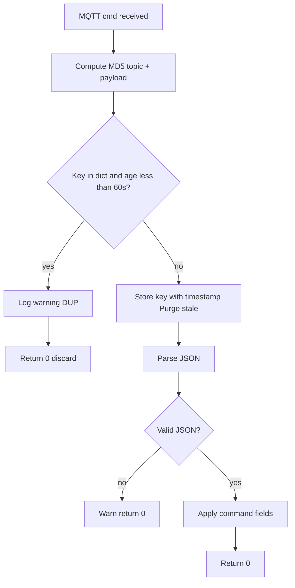

# DUP Flag Handler — Logic Flow

Command topic: `campus/b01/f{FF}/r{RRR}/cmd` (QoS 2 supported).

1. **Input:** incoming MQTT command message on `/cmd` topic (`_on_message`).
2. **Fingerprint:** `MD5(topic + raw_payload_bytes)` → `msg_key` (stable across QoS 2 retries).
3. **Lookup:** `_is_duplicate(msg_key)` consults `self._seen_msg_ids` (60-second TTL):
   - Purge entries older than 60 seconds.
   - If `msg_key` already present → log warning **"DUP detected"** → return **0** (discard, do not apply command).
   - If new → store `{msg_key: now}` → return **False** so processing continues.
4. **Decode:** JSON payload; apply `hvac_mode`, `target_temp`, `lighting_dimmer`.

The broker may set the MQTT **DUP** flag on retransmissions; deduplication is **payload-based**, so identical replays are suppressed even if DUP is not signaled (e.g. rapid duplicate publishes).

## Flow chart

Use this diagram in reliability / PDF reports (export Mermaid via your editor or [mermaid.live](https://mermaid.live)).
